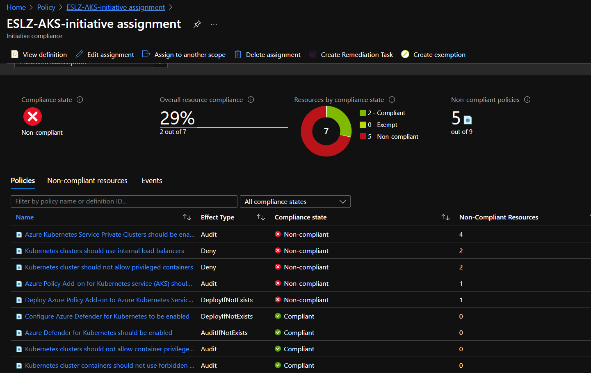

### ARM Templates for Azure Policy Initiative for for ES AKS ###

The ARM Templates in this directory creates an Enterprise Scale secure baseline Policy Initiative consisting of selected default Azure policies related to Azure Kubernetes Services (AKS). 

This initiative  can be used to audit any brownfield environment to make sure that the AKS clusters comply with the Enterprise Scale best practices. With the enforcement mode set to “Default”, this initiative can be also used to enforce the prohibitive policies for new AKS clusters.  

This ARM template creates 2 resources. It first creates a policy initiative comprising of the default policies in the subscription. It then creates a Policy assignment resource, which assigns this newly created initiative to the subscription.

The ARM Template currently groups the following policies as a custom initiative "ES-AKS-Initiative" and applies them in the audit mode. Additional policies can be added to the list for more coverage as needed. 

* Azure Kubernetes Service Private Clusters should be enabled
* Azure Policy Add-on for Kubernetes service (AKS) should be installed and enabled on your clusters
* Azure Defender for Kubernetes should be enabled
* Deploy Azure Policy Add-on to Azure Kubernetes Service clusters
* Kubernetes clusters should not allow container privilege escalation
* Kubernetes cluster should not allow privileged containers
* Kubernetes cluster containers should not use forbidden sysctl interfaces
* Kubernetes clusters should use internal load balancers

Once the initiative is assigned, you can verify the compliance details from the Azure portal. 

Example:

              

#### More details on these policies to follow