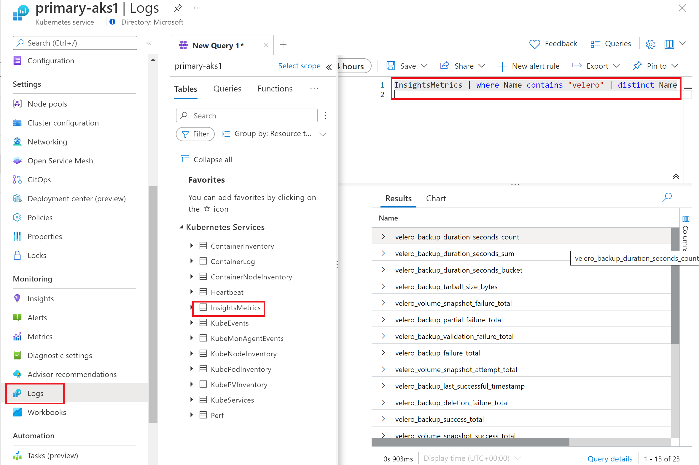

# Monitoring Velero with Azure 

## Monitoring Velero

Velero exposes [Metrics](https://github.com/vmware-tanzu/velero/blob/main/pkg/metrics/metrics.go) for monitoring, available for scraping with a tool such as Prometheus.


On Azure, You don't need to setup your own Prometheus server: Azure Container Insights knows how to scrape Prometheus Metrics, and you can export your metrics to Azure seamlessly.


Read the documentation on Prometheus Integration: 
https://docs.microsoft.com/en-us/azure/azure-monitor/containers/container-insights-prometheus-integration


## How to enable Azure Container Insights for scraping Prometheus metrics ?

To enable scraping with Container insights, you simply need to deploy a ConfigMap related to metrics & data collection.


You can find [an example, in this repository](./container-azm-ms-agentconfig.yaml) for testing purposes (we recommend to download the latest version from the documentation link above).

In this example (because Velero already exports the monitoring metrics), we simply *enable monitoring_kubernetes_pods* in the ConfigMap, and that's it !
```bash
        monitor_kubernetes_pods = true
        ## Restricts Kubernetes monitoring to namespaces for pods that have annotations set and are scraped using the monitor_kubernetes_pods setting.
        ## This will take effect when monitor_kubernetes_pods is set to true
        # ex. monitor_kubernetes_pods_namespaces = ["velero"]
```

   - Run the following command to deploy the configMap to the AKS cluster: 
    ```bash
    kubectl  apply -f  container-azm-ms-agentconfig.yaml
    ```

## Viewing  Velero Metrics in Azure

You can access Insights on Velero Metrics, by viewing the *InsightsMetrics* of your AKS cluster.





## Viewing Metrics for failed backups

You can simply filter the name for the metric: velero_backup_failure_total


## Creating an Alert for failed backups

You can create an Alert When the **value** of velero_backup_failure_total exceeds a threshold (example >=1)


## Monitoring Backups & Restores

- You will need to setup the Log Analytics workspaces for both the source AKS (where backups are taken), and the target (where they are restored).
- If you plan to you Azure Container Insights, You'll need to setup the ConfigMap (monitoring) configuration on both clusters.
