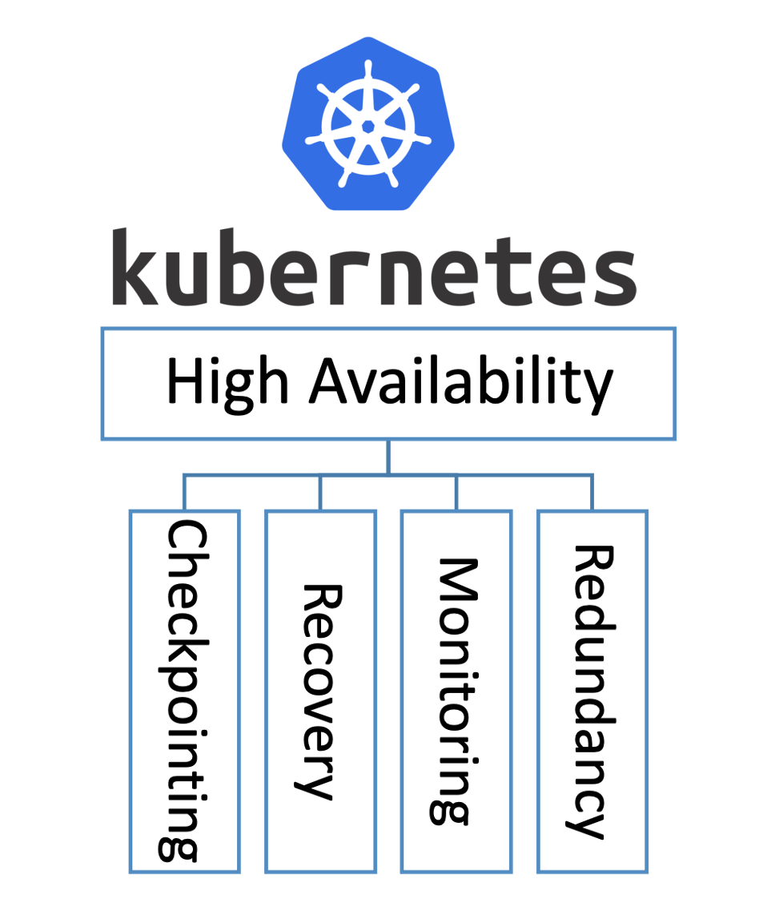
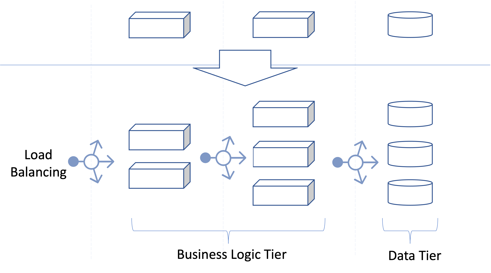
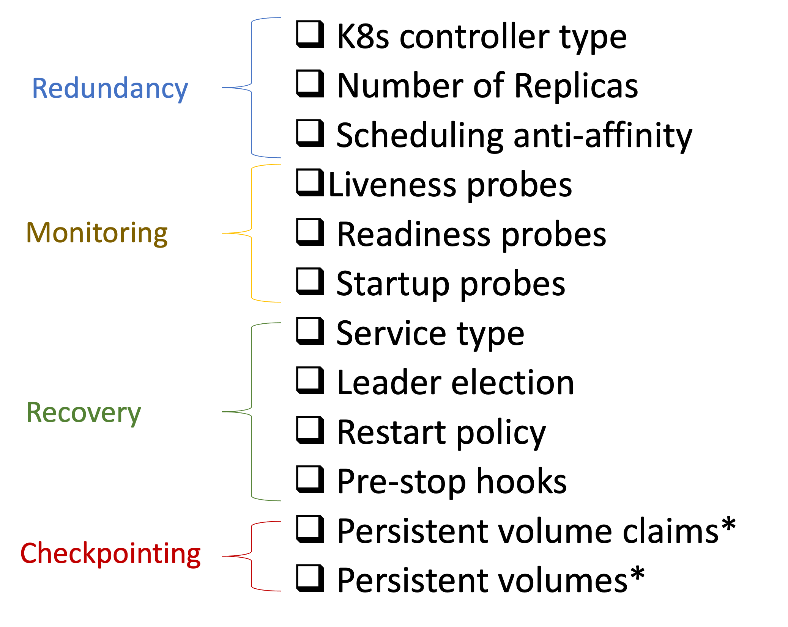

# High Availability (HA) Baseline for Enterprise-grade applications on AKS

Consider a simple multi-tiered application, what would it take to enable it for high availability?

 

There are two fundamental questions to be answered here:

1- is there any single point of failure in the application?

2- how do I eliminate those single points of failures?

## The Four Pillars of High Availability

Eliminating single points of failures requires a High Availability solution. There are four pillars of High Availability that appear in virtually every highly available system one way or another. Regardless whether the system is a database management system, or a large application like a social networking service with billions of users. The difference would be the scope (cluster/zone/region) where the solution is applied. The scope would also determine the difference between high availability and disaster recovery.

 

## Identifying and Eliminating Single Points of Failure:

We start by identifiying the critical path between the client requests and the components involved in serving those requests. 

Any component on this path that is not managed according to the four principles (three if it is a stateless component without checkpointing) is considered a single point of failure.

To eliminate single points of failures, we shoudl deploy our application in such a way to replicate our critical path components, and employ load balancers, monitoring and recovery mechanisms. Luckily, Kubernetes can handle all the those aspects for us.

 

## The Kuberenetes Four Pillars of HA Checklist:

Kubernetes offers several constructs (e.g., Services with load balancing) and mechanism (e.g., liveness probes) to help monitor and recover applications. They are mainly divided into four categories:

 

### Redundancy:

`Controller type (kind: Deployment)`: K8s offers several controllers that can manage the lifecycle of your application’s pod. By far, the most popular one is the deployment. But other controllers include the statefulset, which comes in handy when maintaining the pod identity after a recovery is important. Other controllers such as replicasets do not offer the same useful functionality (such as rollbacks) that the deployment offers.

`Number of replicas (spec.replicas)`: if the number of replicas is only 1, then this is a deliberate decision to use a cold standby model. This means that when a failure happens, a new instance will be started from scratch. This might work for components with low volume workload, but for stateless components with high volumes, a single replica is something to reconsider.

`Scheduling anti-affinity (spec.affinity.podAntiAffinity)`: in a typical production level cluster of Kubernetes you would have nodes spread across multiple availability zones (expressed using a topologyKey), and you would want the pod’s of the same deployment to have preferred (soft) anti-affinity with each other. This will ensure they scheduled on nodes in different availability zones.

### Monitoring:

`Liveness probes (spec.containers.livenessProbe)`: K8s monitors the health of you pods through the liveness probes (unless the container crashes/exits, then K8s can detect it). When liveness fails, the container is restarted.

`Readiness probes (spec.containers.readinessProbe)`: K8s uses the probes to determine whether to send traffic or not to the pod. So if all the readiness pods of a deployment are not ready, they will not be part of the endpoints of the K8s service abstracting the deployment, and therefore will not be useful. As a result, it is important to carefully set the readiness probes, since they do not trigger a restart, they are more used for isolation.

`Startup probes (spec.containers.startupProbe)`: are mainly used in order not have a false positives for readiness and liveness in slow starting applications. Once the startup probe has succeeded, the liveness probe kicks in.

### Recovery:

`Service type (spec.type)`: arguably, exposing your pods through a service can be classified under redundancy as well as recovery (however, in some cases, you might have a single replica deployment. Yet there is still benefits for exposing it through a service even though there is no load balancing). The main advantages of service is the DNS entries that are automatically updated with the service endpoints in K8s. One thing to note here, is that despite the fact that the load balancing ability of clusterIP services in K8s is very rudimentary. A headless service can still be used couple with ingress or other service mesh solutions the ensure better balanced lad distribution.

But what about external traffic? how would it reach your AKS cluster? this is outside the scope of Kubernetes and can be handled by services such as [Azure Application Gateway](https://azure.microsoft.com/en-us/services/application-gateway/#overview)

`Leader election`: some components are best deployed as singletons. E.g., the scheduler is such a component, since two active schedulers can conflict. Having a single replica exposes the application to the cold standby issue discussed above. To enable the use of a warm standby of a pod, leader-election can be used, where only one pod (the leader) handles the requests.

`Restart policy(spec.restartPolicy)`: the restart policy applies to all containers in the Pod. if this attribute is set to Never , then there should be a valid justification for that. (some containers contact a license server each time they start, and we might want to avoid additional costs caused by excessive restarts)

`Pre-stop hooks (spec.containers.lifecycle.preStop)`: pre-stop hooks are executed right before a sigterm is sent to the container. A pre-stop script can be as simple as a sleep command for 30 seconds. You might be wondering what good this might do? Imagine your application is scaling down (e.g., it is managed by an HPA). Unless you have an sigterm handler in the application code that completes serving the in-progress requests before exiting, they might be abruptly terminated. When the pre-stop handle is executed, the pod endpoint is removed from the service endpoint and therefore the DNS. This means that while the pre-stop handle is executing, no new requests are sent to the pod. This allows the pod to finish processing its in-progress requests, without receiving new ones. Think of pre-stop hooks as a simple way to minimize dropped requests without modifying the application code.

### Checkpointing:

Kubernetes does not provide any mechanisms to handle your application’s state. And this is intentional. State management is a complex task that is not part of container management.
The application state can be persisted in three levels:

`Data records level`: the data is stored in a database. Each record in the database can be replicated across multiple DB instance. This is the most dominant form of state persistent. Especially with managed DBs in the cloud such as [CosmosDB](https://azure.microsoft.com/en-us/services/cosmos-db/#overview).

`File system level`: is typically used to replicate the DB files (e.g., WAL files). Most cloud providers offer plugins for their solutions such as [Azure Files](https://kubernetes.io/docs/concepts/storage/volumes/#azurefile).

`Disk level`: finally, data can be persisted at the block level, which gives the flexibility to define the filesystem to be used as in [Azure Disks](https://kubernetes.io/docs/concepts/storage/volumes/#azuredisk).
With Kubernetes volumes, persistent volumes, and persistent volume claims, the state of the application can be persisted at the File system or disk level. Albeit this is not a common pattern to store state, the more dominant is the first level using the data records level.

## Conclusion:

As an Site Reliabity Engineer (SRE), you should check for the absence of the above mechanisms/constructs. The above checklist is a common list of configuration patterns that are typically leveraged to make the most out of K8s HA management. State management aside, K8s does an exceptional job in maintaining the application high availability.

An example of building HA application running on K8s can be found [here](https://alikanso.medium.com/building-highly-available-applications-with-kubernetes-c57cc04b5b0d).